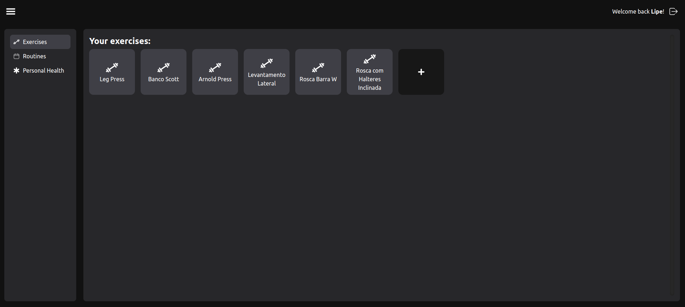

# About

**GymTracker** is a personal fitness web app designed to help users stay motivated and organized in their fitness journey. Whether you're a beginner or an experienced athlete, this app makes it easy to track your workout progress, set goals, and monitor performance over time. By logging exercises, sets, repetitions, and weights, you can get a clear picture of your growth and achievements.

- [Website](https://gym-tracker-front-two.vercel.app/)
- [API Endpoints](https://gym-tracker-api-two.vercel.app/)
- [GitHub Repository](https://github.com/lipeaaraujo/GymTracker)

## Features

- **User Authentication**: Create an account to access your personal data and track your progress.
- **Workout Log**: Log your exercises, sets, repetitions, and weights to keep track of your workouts.
- **Progress Tracking**: Monitor your performance over time and set goals to achieve your fitness objectives.

## Technologies

MERN Stack (MongoDB, Express, React, Node.js):

- **Frontend**: React (Website)
- **Backend**: Node.js, Express
- **Database**: MongoDB

## Version History

| Version | Date       | Description | Author |
| ------- | ---------- | ----------- | ------ |
| 1.0   | 24/01/2024 | Creating document | [lipeaaraujo](https://github.com/lipeaaraujo) |