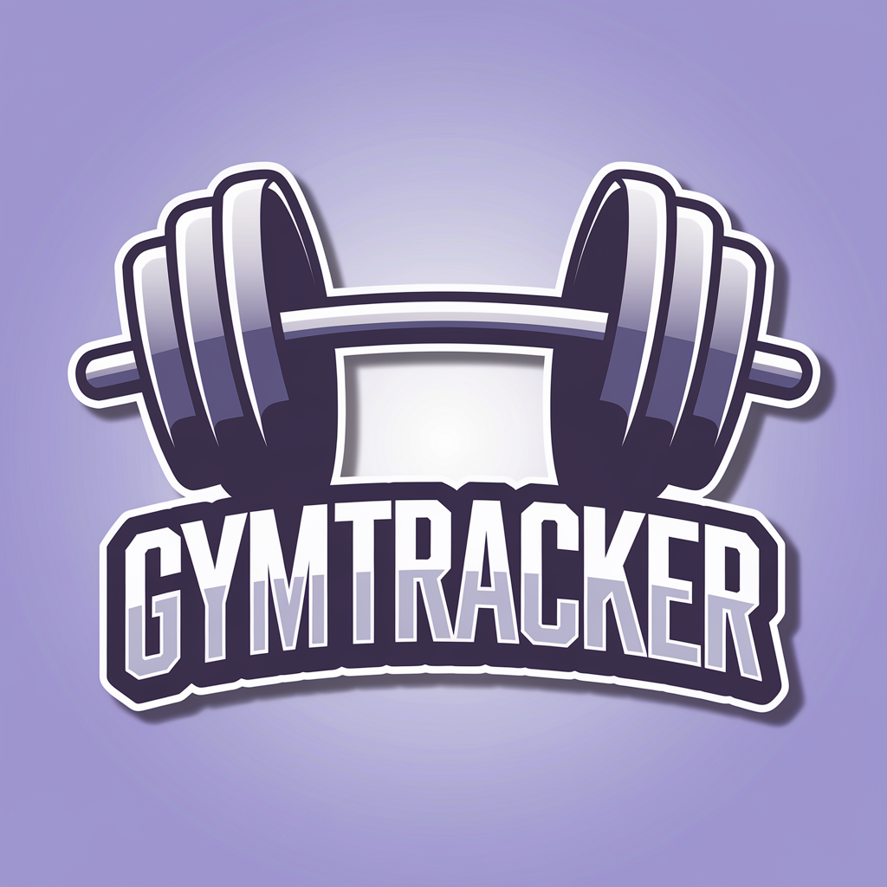

# Gym Tracker Docs

This website has the purpose of documenting the **Gym Tracker** project. Most of the project's documentation artifacts are documented here, including its requirements, architecture, implementation details, and deployment instructions.

- [About](./about.md)

This is a personal project developed by [lipeaaraujo](https://github.com/lipeaaraujo).

I initially developed this project to practice my skills in web development and to create a tool that I could use to track my workouts. I hope you find this project useful. Feel free to contribute to this project by submitting issues or pull requests and by checking out the project's:

- [GitHub repository](https://github.com/lipeaaraujo/GymTracker)
- [Contributing guidelines](./CONTRIBUTING.md)
- [Code of conduct](./CODE_OF_CONDUCT.md)